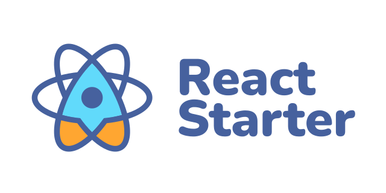

<p align="center">
 
</p>

# React Starter Boilerplate

A highly scalable and focused on performance and best practices boilerplate code for TypeScript based React SPA
applications.

This project was bootstrapped with [Vite](https://github.com/vitejs/vite) and modified by TSH team.

Start your new React application in seconds!


## Features

### Quick scaffolding

Generate React code snippets from the CLI by using Plop micro-generator framework.

### TypeScript

The best way to write modern frontend applications. Code is easier to understand. By using TypeScript it is more
difficult to write invalid code as was the case in dynamically typed languages.

### Static code analysis

Focus on writing code, not formatting it! Code formatter and linter keeps the code clean which makes work and
communication with other developers more effective!

## How to bootstrap your React project

To start your new React project based on the `react-starter-boilerplate` you need to follow this steps:

1. Clone this repository:

```shell
git clone https://github.com/TheSoftwareHouse/react-starter-boilerplate.git
```

2. Change the name of project directory to the name of your project.
   **Also don't forget to change the name of your application in `package.json` file.**

3. Restore git history of the project. To do that, run following commands:

```shell
sudo rm -r .git
git init
git remote add origin <your empty project repository>
git remote -v
```

4. Replace this file with `PROJECT_README.md` and fill all the placeholders with data about your project:

```shell
mv PROJECT_README.md README.md
```

5. Add all files to git history and create initial commit:

```shell
git add .
git commit -m 'Initial commit'
git push origin master
```

6. Copy the `.env.dist` file to `.env.local` and populate the environment variables with the values used in the local
   environment

```shell
cp .env.dist .env.local
```

Now, your project is bootstrapped successfully! 🎉

You can install dependencies and start developing your React application 🚀

## Scripts

```shell
npm run [command_name]
```

- `start` - Launches the app in development mode on [http://localhost:3000](http://localhost:3000)
- `build` - Compiles and bundles the app for deployment*
- `build:ci` - Build command optimized for CI/CD pipelines
- `build:analyze` - Builds the app and opens the rollup-plugin-visualizer report in the browser
- `typecheck` - Validate the code using TypeScript compiler
- `preview` - Boot up a local static web server that serves application build. It's an easy way to check if the
  production build looks OK on your local machine
- `test` - Run unit tests with vitest
- `coverage` - Run unit tests with code coverage calculation
- `lint` - Validate the code using ESLint and Prettier
- `lint:fix` - Validate and fix the code using ESLint and Prettier
- `plop` - Run CLI with commands for code generation
- `translations` - Run [Babelsheet](https://github.com/TheSoftwareHouse/babelsheet2) tool for fetch the latest
  translations
- `serve:cypress` - Run Cypress E2E tests panel
- `version` - Build CHANGELOG file base on git commits history
- `e2e:open` - Run E2E tests panel
- `e2e:ci:firefox`: Run E2E tests on Firefox browser in CI pipelines
- `e2e:ci:chrome`: Run E2E tests on Chrome browser in CI pipelines

*See the section about [deployment](https://vitejs.dev/guide/static-deploy.html) for more information.


## Screenshot → Code with Copilot (and other AI Tools)

This workflow is designed for VS Code with GitHub Copilot, Cursor/Trae, JetBrains AI Assistant, Claude, or any similar AI coding tool.
The authoritative reference is always `.github/copilot-instructions.md`.

---

### Step 1: Open your AI coding assistant
- **VS Code:** use Copilot Chat.
- **Cursor/Trae:** open the chat panel and paste the prompt.
- **JetBrains:** use the AI Assistant tool window.
- **Claude/other web-based LLMs:** paste the prompt directly in the conversation.

---

### Step 2: Drag & drop the screenshot
Attach the relevant screenshot into the assistant chat (or upload if drag & drop is not supported).

---

### Step 3: Paste this prompt

Use the repository’s `.github/copilot-instructions.md` STRICTLY.
From the screenshot, generate a COMPLETE, WORKING implementation (files + code + tests + route + menu).

Output IN THIS ORDER:

1. File tree with all new/changed files.
2. Full content of every new/changed file.
3. Router and menu diffs (ready to apply).
4. Unit tests (Vitest + RTL) and e2e tests (Playwright, if `e2e/` exists).
5. Storybook stories for reusable components (if Storybook is present).
6. Run the full checklist from `copilot-instructions.md` (a11y, performance, imports, commits) and report PASS/FAIL per item.
7. Show the validation commands you expect to pass.

Rules:

* `copilot-instructions.md` is authoritative — do NOT restate or override it.
* UI ONLY from our DS (`@/shared/ui`) and layout (`@/shared/layout`), no external UI libs, NO inline styles, DS tokens only.
* ≤2 levels of nesting, early returns, NO if–else chains (extract helpers).
* Add routing + menu in the SAME PR; include tests.
* If any rule cannot be met, STOP and explain the blocker instead of guessing.

---

### Step 4: Validate locally
Run all checks before committing:

```bash
pnpm lint --fix && pnpm typecheck && pnpm test
pnpm build:storybook     # if the project includes Storybook
pnpm depcheck            # check for unused dependencies
````

---

### Expected output

* A new page and its feature components.
* Routing and menu entry updated.
* Unit tests and e2e tests (if applicable).
* Storybook stories for reusable components (if Storybook exists).
* Full compliance with `.github/copilot-instructions.md`.

---

### Important

* The **same instructions apply regardless of the tool** (Copilot, Cursor, JetBrains AI, Claude, etc.).
* For web-based tools (Claude, ChatGPT, Gemini), paste both the screenshot and the prompt exactly as shown.
* For local IDE integrations (Copilot, Cursor, JetBrains), drag & drop the screenshot and paste the prompt.


## Table of Contents

1. [Technology stack](/docs/01-technology-stack.md)
2. [Application structure](/docs/02-application-structure.md)
3. [React Query abstraction](/docs/03-react-query-abstraction.md)
4. [Using plop commands](/docs/04-using-plop-commands.md)
5. [E2E tests](/docs/05-e2e-tests.md)

## How to Contribute

Anyone and everyone is welcome to contribute. Start by checking out the list
of [open issues](https://github.com/TheSoftwareHouse/react-starter-boilerplate/issues).

However, if you decide to get involved, please take a moment to review the [guidelines](CONTRIBUTING.md).

## License

Copyright © 2021-present The Software House. This source code is licensed under the MIT license found in the
[LICENSE](LICENSE.md) file.

---
<sup>
Made with ♥ by The Software House (<a href="https://tsh.io">website</a>, <a href="https://tsh.io/blog">blog</a>)
and <a href="https://github.com/TheSoftwareHouse/react-starter-boilerplate/graphs/contributors">contributors</a>.
</sup>
